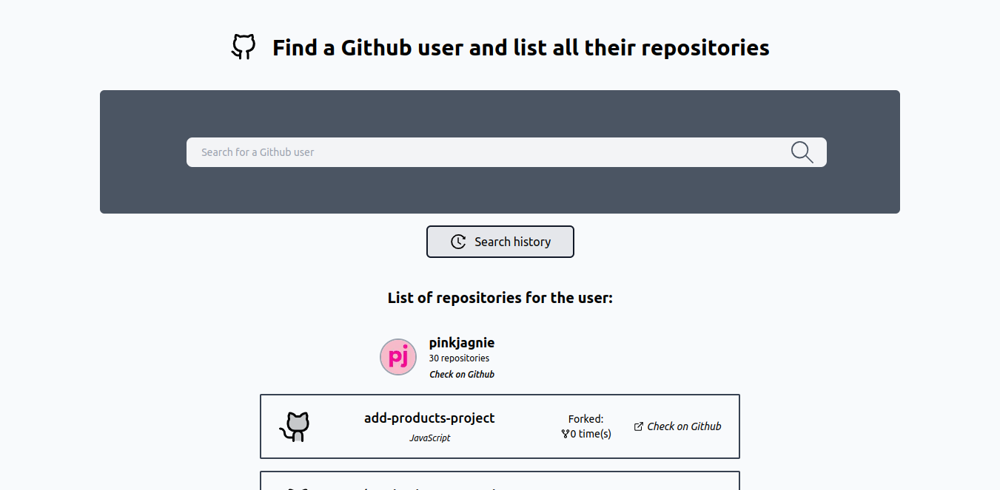

# 👥 Users Github Project

### Description

This project is based on fetching data from an external API.
Tech stack: Next.JS, Tailwind, Axios, React Icons.

After sending the query by the user, a result or an error message is returned. The correctness of the query is also checked - whether it does not contain empty spaces - and if it is, an appropriate error message is returned.

The search history functionality is handled using localStorage.

### Preview

###### Home page with response

